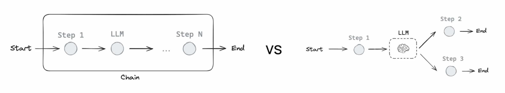

# Module 1

## Introduction

Many LLM apps use a control flow:

Start -> Step 1 -> LLM -> ... -> Step N -> End

with steps pre/post-LLM calls (tool calls, retrievals, etc.)

This forms a "chain". Same control flow every time so very reliable and easy to reason about.

But we want Agents that can pick their own control flow!

> Agents are systems where the control flow is defined by the LLM.

Practical Challenge:

- X axis: Agent's level of control low to high
- Y axis: Application's reliability low to high

Basic routers are low control, high reliability. Autonomous agents are high control, low reliability. LangGraph lets you increase reliability for highly autonomous agents. "Bends" the curve upwards.

Intuition: Let developer set parts of control flow (reliable), inject LLM to make it an agent (control), Express the custom control flows as graphs (LangGraph)

LangGraph Pillars: Persistence, Streaming, Human in the Loop, Controllability

LangGraph is application orchestration, LangChain is application components / integrations.

## Simple Graph

### Nodes and Edges

[Nodes](https://langchain-ai.github.io/langgraph/concepts/low_level/#nodes) are just python functions.

The first positional argument is the state.

Because the state is a `TypedDict` with schema, each node can access the key, `graph_state`, with `state['graph_state']`. Each node returns a new value of the state key `graph_state`.

By default, the new value returned by each node [will override](https://langchain-ai.github.io/langgraph/concepts/low_level/#reducers) the prior state value.

[Edges](https://langchain-ai.github.io/langgraph/concepts/low_level/#edges) connect the nodes. Normal Edges are used if you want to _always_ go from, for example, `node_1` to `node_2`.

[Conditional Edges](https://langchain-ai.github.io/langgraph/reference/graphs/?h=conditional+edge#langgraph.graph.StateGraph.add_conditional_edges) are used want to _optionally_ route between nodes. Conditional edges are implemented as functions that return the next node to visit based upon some logic.

### Graph Construction

Now, we build the graph from our [components](https://langchain-ai.github.io/langgraph/concepts/low_level/) defined above.

The [StateGraph class](https://langchain-ai.github.io/langgraph/concepts/low_level/#stategraph) is the graph class that we can use.

First, we initialize a StateGraph with the `State` class we defined above.

Then, we add our nodes and edges.

We use the [`START` Node, a special node](https://langchain-ai.github.io/langgraph/concepts/low_level/#start-node) that sends user input to the graph, to indicate where to start our graph.

The [`END` Node](https://langchain-ai.github.io/langgraph/concepts/low_level/#end-node) is a special node that represents a terminal node.

Finally, we [compile our graph](https://langchain-ai.github.io/langgraph/concepts/low_level/#compiling-your-graph) to perform a few basic checks on the graph structure.

We can visualize the graph as a [Mermaid diagram](https://github.com/mermaid-js/mermaid).

### Graph Invocation

The compiled graph implements the [runnable](https://python.langchain.com/v0.1/docs/expression_language/interface/) protocol.

This provides a standard way to execute LangChain components.

`invoke` is one of the standard methods in this interface.

The input is a dictionary `{"graph_state": "Hi, this is lance."}`, which sets the initial value for our graph state dict.

When `invoke` is called, the graph starts execution from the `START` node.

It progresses through the defined nodes (`node_1`, `node_2`, `node_3`) in order.

The conditional edge will traverse from node `1` to node `2` or `3` using a 50/50 decision rule.

Each node function receives the current state and returns a new value, which overrides the graph state.

The execution continues until it reaches the `END` node.

`invoke` runs the entire graph synchronously.

This waits for each step to complete before moving to the next.

It returns the final state of the graph after all nodes have executed.
